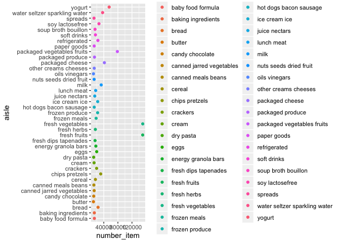
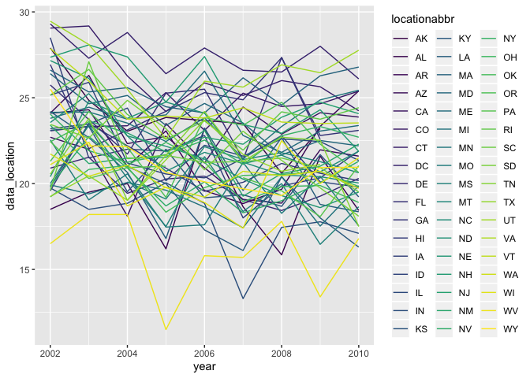
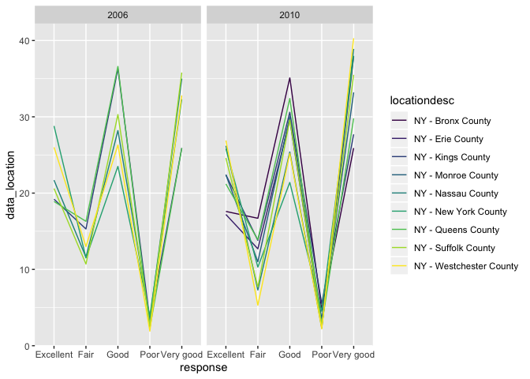

HW3
================

\#Load Libraries and Set-Up

\#Problem 1

``` r
#Load data from p8105 git repository

library(p8105.datasets)
data("instacart")

##Exploratory analysis to look at generally what products, aisles, and how many of each product are ordered
instacart_df =
  select(instacart, product_name, department, add_to_cart_order, reordered) %>%
  mutate(number_order = add_to_cart_order + reordered) %>%
  arrange(department) %>%
  select(-add_to_cart_order, -reordered)

instacart_df
```

    ## # A tibble: 1,384,617 x 3
    ##    product_name                 department number_order
    ##    <chr>                        <chr>             <int>
    ##  1 Chardonnay Wine              alcohol               4
    ##  2 Sauvignon Blanc              alcohol               2
    ##  3 India Pale Ale               alcohol               6
    ##  4 Lucky 13 Ale                 alcohol               1
    ##  5 Triple Distilled Vodka       alcohol               2
    ##  6 American Concord Grape       alcohol               9
    ##  7 Vodka                        alcohol               2
    ##  8 Pinot Noir                   alcohol               8
    ##  9 Chardonnay Sonoma Coast 2008 alcohol               9
    ## 10 Chianti Classico             alcohol              10
    ## # … with 1,384,607 more rows

\#\#Aisles Questions

``` r
aisles_df = 
  select(instacart, aisle_id, aisle, product_name, add_to_cart_order, reordered) %>%
  mutate(number_order = add_to_cart_order + reordered)
#Finding the number of distinct aisles 
nrow(distinct(aisles_df, aisle_id))
```

    ## [1] 134

``` r
#Finding the aisles where the most items are ordered from
group_by(aisles_df, aisle) %>%
  summarize(n = n()) %>%
  arrange(desc(n))
```

    ## # A tibble: 134 x 2
    ##    aisle                              n
    ##    <chr>                          <int>
    ##  1 fresh vegetables              150609
    ##  2 fresh fruits                  150473
    ##  3 packaged vegetables fruits     78493
    ##  4 yogurt                         55240
    ##  5 packaged cheese                41699
    ##  6 water seltzer sparkling water  36617
    ##  7 milk                           32644
    ##  8 chips pretzels                 31269
    ##  9 soy lactosefree                26240
    ## 10 bread                          23635
    ## # … with 124 more rows

There are 134 aisles in the dataset with fresh vegetables, fresh fruits,
and packaged vegetables fruits aisles containing the most items ordered.

\#\#Number of items ordered in each aisle

``` r
ordered_items = 
  group_by(aisles_df, aisle) %>%
  summarize(n = n()) %>%
  arrange(desc(n)) %>%
  filter(n > 10000) %>%
  mutate(number_item = (n)) %>%
  select(-n)

ordered_items
```

    ## # A tibble: 39 x 2
    ##    aisle                         number_item
    ##    <chr>                               <int>
    ##  1 fresh vegetables                   150609
    ##  2 fresh fruits                       150473
    ##  3 packaged vegetables fruits          78493
    ##  4 yogurt                              55240
    ##  5 packaged cheese                     41699
    ##  6 water seltzer sparkling water       36617
    ##  7 milk                                32644
    ##  8 chips pretzels                      31269
    ##  9 soy lactosefree                     26240
    ## 10 bread                               23635
    ## # … with 29 more rows

## Ggplot of aisles with more than 10,000 items

``` r
ggplot(ordered_items, aes(x = number_item, y = aisle, color = aisle)) +
         geom_point()
```

<!-- -->

## Table of top three items in Baking Ingredients, Dog Food Care, and Packaged Vegetables Fruits

``` r
top_baking_ing = 
  filter(instacart, aisle == "baking ingredients") %>%
    pivot_wider(
      names_from = "aisle",
      values_from = "product_name"
    ) %>%
  mutate(number_ordered = add_to_cart_order + reordered) %>%
  arrange(desc(number_ordered)) %>%
  head(3)
  
top_baking_ing
```

    ## # A tibble: 3 x 15
    ##   order_id product_id add_to_cart_ord… reordered user_id eval_set
    ##      <int>      <int>            <int>     <int>   <int> <chr>   
    ## 1  1482636      30751               68         0  111302 train   
    ## 2  1747908      26767               56         0  145432 train   
    ## 3  2190647      23537               56         0   59753 train   
    ## # … with 9 more variables: order_number <int>, order_dow <int>,
    ## #   order_hour_of_day <int>, days_since_prior_order <int>, aisle_id <int>,
    ## #   department_id <int>, department <chr>, `baking ingredients` <chr>,
    ## #   number_ordered <int>

``` r
top_dog_food = 
  filter(instacart, aisle == "dog food care") %>%
    pivot_wider(
      names_from = "aisle",
      values_from = "product_name"
    ) %>%
  mutate(number_ordered = add_to_cart_order + reordered) %>%
  arrange(desc(number_ordered)) %>%
  head(3)

top_dog_food
```

    ## # A tibble: 3 x 15
    ##   order_id product_id add_to_cart_ord… reordered user_id eval_set
    ##      <int>      <int>            <int>     <int>   <int> <chr>   
    ## 1    45138      26512               66         0   82931 train   
    ## 2  2893277      32168               54         0  148012 train   
    ## 3  2706631      42355               47         0   24909 train   
    ## # … with 9 more variables: order_number <int>, order_dow <int>,
    ## #   order_hour_of_day <int>, days_since_prior_order <int>, aisle_id <int>,
    ## #   department_id <int>, department <chr>, `dog food care` <chr>,
    ## #   number_ordered <int>

``` r
top_packaged = 
  filter(instacart, aisle == "packaged vegetables fruits") %>%
    pivot_wider(
      names_from = "aisle",
      values_from = "product_name"
    ) %>%
  mutate(number_ordered = add_to_cart_order + reordered) %>%
  arrange(desc(number_ordered)) %>%
  head(3)
  
top_packaged
```

    ## # A tibble: 3 x 15
    ##   order_id product_id add_to_cart_ord… reordered user_id eval_set
    ##      <int>      <int>            <int>     <int>   <int> <chr>   
    ## 1  2813632      41771               80         1  149753 train   
    ## 2  1395075      45063               78         1  197541 train   
    ## 3  2869702       4920               74         1   83993 train   
    ## # … with 9 more variables: order_number <int>, order_dow <int>,
    ## #   order_hour_of_day <int>, days_since_prior_order <int>, aisle_id <int>,
    ## #   department_id <int>, department <chr>, `packaged vegetables
    ## #   fruits` <chr>, number_ordered <int>

``` r
top_three = 
  bind_rows(top_baking_ing, top_dog_food, top_packaged) %>%
  janitor::clean_names() %>%
  select(-everything(), number_ordered, baking_ingredients, dog_food_care, packaged_vegetables_fruits) %>%
  arrange(desc(number_ordered))

top_three
```

    ## # A tibble: 9 x 4
    ##   number_ordered baking_ingredients  dog_food_care      packaged_vegetable…
    ##            <int> <chr>               <chr>              <chr>              
    ## 1             81 <NA>                <NA>               Fresh European Sty…
    ## 2             79 <NA>                <NA>               Organic Baby Bella…
    ## 3             75 <NA>                <NA>               Seedless Red Grapes
    ## 4             68 All-Purpose Flour   <NA>               <NA>               
    ## 5             66 <NA>                Sausage Cuts Real… <NA>               
    ## 6             56 No Calorie Sweeten… <NA>               <NA>               
    ## 7             56 Light Brown Sugar   <NA>               <NA>               
    ## 8             54 <NA>                Dentastix Small/M… <NA>               
    ## 9             47 <NA>                ProActive Health … <NA>

## Mean hour of the day Pink Lady Apples and Coffee Ice Cream

``` r
mean_hour = 
  select(instacart, product_id, product_name, order_hour_of_day, order_dow) %>%
  filter(product_name == "Pink Lady Apples" | product_name == "Coffee Ice Cream") %>%
  group_by(product_id) %>%
  mutate(week_day = recode(order_dow, 
       "0" = "Sunday",
       "1" = "Monday",
       "2" = "Tuesday",
       "3" = "Wednesday",
       "4" = "Thursday",
       "5" = "Friday",
       "6" = "Saturday")) %>%
  group_by(product_name, week_day) %>%
  mutate(mean_hour = mean(order_hour_of_day)) %>%
  select(-order_hour_of_day, -order_dow, -product_id) %>% 
  arrange(week_day) %>%
  distinct() %>%
  knitr::kable()

mean_hour
```

| product\_name    | week\_day | mean\_hour |
| :--------------- | :-------- | ---------: |
| Pink Lady Apples | Friday    |   12.78431 |
| Coffee Ice Cream | Friday    |   12.26316 |
| Pink Lady Apples | Monday    |   11.36000 |
| Coffee Ice Cream | Monday    |   14.31579 |
| Coffee Ice Cream | Saturday  |   13.83333 |
| Pink Lady Apples | Saturday  |   11.93750 |
| Pink Lady Apples | Sunday    |   13.44118 |
| Coffee Ice Cream | Sunday    |   13.77419 |
| Pink Lady Apples | Thursday  |   11.55172 |
| Coffee Ice Cream | Thursday  |   15.21739 |
| Coffee Ice Cream | Tuesday   |   15.38095 |
| Pink Lady Apples | Tuesday   |   11.70213 |
| Pink Lady Apples | Wednesday |   14.25000 |
| Coffee Ice Cream | Wednesday |   15.31818 |

\#Problem 2

## Cleaning BRFSS data

``` r
library(p8105.datasets)
data("BRFSS")
```

    ## Warning in data("BRFSS"): data set 'BRFSS' not found

``` r
brfss_data = 
  select(brfss_smart2010, everything()) %>%
  janitor::clean_names() %>%
  filter(topic == "Overall Health" | 
           response == "Excellent" | 
           response == "Very good" | 
           response == "Good" |
           response == "Fair" |
           response == "Poor") %>%
  arrange(response == "Excellent", response == "Very good", response == "Good", response == "Fair", response == "Poor")

brfss_data
```

    ## # A tibble: 10,625 x 23
    ##     year locationabbr locationdesc class topic question response
    ##    <int> <chr>        <chr>        <chr> <chr> <chr>    <chr>   
    ##  1  2010 AL           AL - Jeffer… Heal… Over… How is … Poor    
    ##  2  2010 AL           AL - Mobile… Heal… Over… How is … Poor    
    ##  3  2010 AL           AL - Tuscal… Heal… Over… How is … Poor    
    ##  4  2010 AZ           AZ - Marico… Heal… Over… How is … Poor    
    ##  5  2010 AZ           AZ - Pima C… Heal… Over… How is … Poor    
    ##  6  2010 AZ           AZ - Pinal … Heal… Over… How is … Poor    
    ##  7  2010 AR           AR - Benton… Heal… Over… How is … Poor    
    ##  8  2010 AR           AR - Pulask… Heal… Over… How is … Poor    
    ##  9  2010 AR           AR - Washin… Heal… Over… How is … Poor    
    ## 10  2010 CA           CA - Alamed… Heal… Over… How is … Poor    
    ## # … with 10,615 more rows, and 16 more variables: sample_size <int>,
    ## #   data_value <dbl>, confidence_limit_low <dbl>,
    ## #   confidence_limit_high <dbl>, display_order <int>,
    ## #   data_value_unit <chr>, data_value_type <chr>,
    ## #   data_value_footnote_symbol <chr>, data_value_footnote <chr>,
    ## #   data_source <chr>, class_id <chr>, topic_id <chr>, location_id <chr>,
    ## #   question_id <chr>, respid <chr>, geo_location <chr>

## 2002:states with 7 or more locations

``` r
first_year_data = 
  group_by(brfss_data, year) %>%
  filter(year == 2002) %>%
  group_by(locationabbr) %>%
  count(locationabbr) %>%
  filter(n > 7) 

first_year_data
```

    ## # A tibble: 36 x 2
    ## # Groups:   locationabbr [36]
    ##    locationabbr     n
    ##    <chr>        <int>
    ##  1 AZ              10
    ##  2 CO              20
    ##  3 CT              35
    ##  4 DE              15
    ##  5 FL              35
    ##  6 GA              15
    ##  7 HI              20
    ##  8 ID              10
    ##  9 IL              15
    ## 10 IN              10
    ## # … with 26 more rows

## 2010: states with 7 or more locations

``` r
second_year_data = 
  group_by(brfss_data, year) %>%
  filter(year == 2010) %>%
  group_by(locationabbr) %>%
  count(locationabbr) %>%
  filter(n > 7)

second_year_data
```

    ## # A tibble: 45 x 2
    ## # Groups:   locationabbr [45]
    ##    locationabbr     n
    ##    <chr>        <int>
    ##  1 AL              15
    ##  2 AR              15
    ##  3 AZ              15
    ##  4 CA              60
    ##  5 CO              35
    ##  6 CT              25
    ##  7 DE              15
    ##  8 FL             205
    ##  9 GA              20
    ## 10 HI              20
    ## # … with 35 more rows

\#\#Excellent responses across statements

``` r
excellent_response = 
  select(brfss_data, response, year, locationabbr, data_value) %>%
  filter(response == "Excellent") %>%
  group_by(locationabbr, year) %>%
  mutate(data_location = mean(data_value)) %>%
  select(-data_value) %>%
  group_by(locationabbr) %>%
  distinct()

excellent_response
```

    ## # A tibble: 443 x 4
    ## # Groups:   locationabbr [51]
    ##    response   year locationabbr data_location
    ##    <chr>     <int> <chr>                <dbl>
    ##  1 Excellent  2010 AL                    18.4
    ##  2 Excellent  2010 AZ                    21.6
    ##  3 Excellent  2010 AR                    25.4
    ##  4 Excellent  2010 CA                    23.9
    ##  5 Excellent  2010 CO                    25.4
    ##  6 Excellent  2010 CT                    24.2
    ##  7 Excellent  2010 DE                    20.3
    ##  8 Excellent  2010 DC                    26.1
    ##  9 Excellent  2010 FL                    NA  
    ## 10 Excellent  2010 GA                    23.1
    ## # … with 433 more rows

## Spaghetti plot of above dataset

``` r
ggplot(excellent_response, aes(x = year, y = data_location)) + 
  geom_line(aes(group = locationabbr, color = locationabbr)) + 
  scale_color_viridis(
    name = "locationabbr",
    discrete = TRUE
  ) 
```

    ## Warning: Removed 3 rows containing missing values (geom_path).

<!-- -->

\#\#Two panel plot showing the states in 2006 and 2010

``` r
ny_state = 
  select(brfss_data, response, year, locationabbr, locationdesc, data_value) %>%
  filter(locationabbr == "NY") %>%
  group_by(locationdesc, response, year) %>%
  mutate(data_location = mean(data_value)) %>%
  select(-data_value) %>%
  group_by(locationabbr) %>%
  filter(xor(year == "2006", year == "2010")) %>%
  distinct()

ny_state
```

    ## # A tibble: 75 x 5
    ## # Groups:   locationabbr [1]
    ##    response  year locationabbr locationdesc            data_location
    ##    <chr>    <int> <chr>        <chr>                           <dbl>
    ##  1 Poor      2010 NY           NY - Bronx County                 4.7
    ##  2 Poor      2010 NY           NY - Erie County                  2.5
    ##  3 Poor      2010 NY           NY - Kings County                 5.5
    ##  4 Poor      2010 NY           NY - Monroe County                3.5
    ##  5 Poor      2010 NY           NY - Nassau County                2.3
    ##  6 Poor      2010 NY           NY - New York County              4.5
    ##  7 Poor      2010 NY           NY - Queens County                2.7
    ##  8 Poor      2010 NY           NY - Suffolk County               2.6
    ##  9 Poor      2010 NY           NY - Westchester County           2.2
    ## 10 Poor      2006 NY           NY - Kings County                 3.3
    ## # … with 65 more rows

## Plot of NY in 2006 and 2010

``` r
ggplot(ny_state, aes(x = response, y = data_location)) +
  geom_line(aes(group = locationdesc, color = locationdesc)) + 
  scale_color_viridis(
    name = "locationdesc",
    discrete = TRUE
  ) +
  facet_grid(~year)
```

<!-- -->

\#Problem 3

``` r
accel_data = 
  read_csv(file = "/Users/hannahbowlin/Documents/Biostats Sem 1/Data Science 1/Data Science/Data Science 1 part a/Visualization and EDA/p8105_hw3_hmb2161/accel_data.csv") %>%
  janitor::clean_names() %>%
  pivot_longer(activity_1:activity_1440,
    names_to = "minute",
    values_to = "activity_amount"
  ) %>%
  group_by(day) 
```

    ## Parsed with column specification:
    ## cols(
    ##   .default = col_double(),
    ##   day = col_character()
    ## )

    ## See spec(...) for full column specifications.

``` r
accel_data
```

    ## # A tibble: 50,400 x 5
    ## # Groups:   day [7]
    ##     week day_id day    minute      activity_amount
    ##    <dbl>  <dbl> <chr>  <chr>                 <dbl>
    ##  1     1      1 Friday activity_1             88.4
    ##  2     1      1 Friday activity_2             82.2
    ##  3     1      1 Friday activity_3             64.4
    ##  4     1      1 Friday activity_4             70.0
    ##  5     1      1 Friday activity_5             75.0
    ##  6     1      1 Friday activity_6             66.3
    ##  7     1      1 Friday activity_7             53.8
    ##  8     1      1 Friday activity_8             47.8
    ##  9     1      1 Friday activity_9             55.5
    ## 10     1      1 Friday activity_10            43.0
    ## # … with 50,390 more rows

  - In this new dataset there are 5 columns instead of over a 1400.
    There are now rows and columns. The variables are week, day\_id,
    day, minute of the day, and amount of activity in that minute.

NEED TO ADD WEEK DAY AND WEEKEND VARIABLES

\#\#Total activity per day

``` r
accel_data %>%
  group_by(week) %>%
  mutate(mean_activity = mean(activity_amount)) %>%
  group_by(day_id)
```

    ## # A tibble: 50,400 x 6
    ## # Groups:   day_id [35]
    ##     week day_id day    minute      activity_amount mean_activity
    ##    <dbl>  <dbl> <chr>  <chr>                 <dbl>         <dbl>
    ##  1     1      1 Friday activity_1             88.4          255.
    ##  2     1      1 Friday activity_2             82.2          255.
    ##  3     1      1 Friday activity_3             64.4          255.
    ##  4     1      1 Friday activity_4             70.0          255.
    ##  5     1      1 Friday activity_5             75.0          255.
    ##  6     1      1 Friday activity_6             66.3          255.
    ##  7     1      1 Friday activity_7             53.8          255.
    ##  8     1      1 Friday activity_8             47.8          255.
    ##  9     1      1 Friday activity_9             55.5          255.
    ## 10     1      1 Friday activity_10            43.0          255.
    ## # … with 50,390 more rows

minrank\!

35 different days on the plots, but you cna plot other trends as well
(35 diferent lines)

convert minutes to hour, divide minute variable by 60
