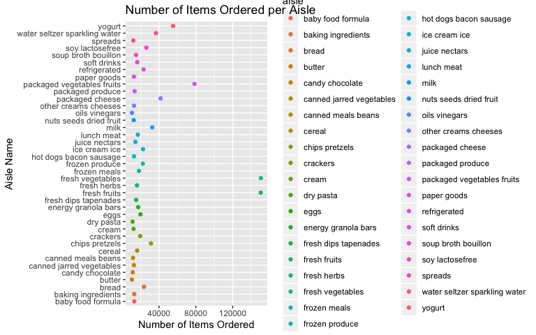

HW3
================

\#Load Libraries and Set-Up

\#Problem 1

``` r
#Load data from p8105 git repository

library(p8105.datasets)
data("instacart")

##Exploratory analysis to look at generally what products, aisles, and how many of each product are ordered
instacart_df =
  select(instacart, product_name, department, add_to_cart_order, reordered) %>%
  mutate(number_order = add_to_cart_order + reordered) %>%
  arrange(department) %>%
  select(-add_to_cart_order, -reordered)

instacart_df
```

    ## # A tibble: 1,384,617 x 3
    ##    product_name                 department number_order
    ##    <chr>                        <chr>             <int>
    ##  1 Chardonnay Wine              alcohol               4
    ##  2 Sauvignon Blanc              alcohol               2
    ##  3 India Pale Ale               alcohol               6
    ##  4 Lucky 13 Ale                 alcohol               1
    ##  5 Triple Distilled Vodka       alcohol               2
    ##  6 American Concord Grape       alcohol               9
    ##  7 Vodka                        alcohol               2
    ##  8 Pinot Noir                   alcohol               8
    ##  9 Chardonnay Sonoma Coast 2008 alcohol               9
    ## 10 Chianti Classico             alcohol              10
    ## # … with 1,384,607 more rows

\#\#Aisles Questions

``` r
aisles_df = 
  select(instacart, aisle_id, aisle, product_name, add_to_cart_order, reordered) %>%
  mutate(number_order = add_to_cart_order + reordered)
#Finding the number of distinct aisles 
nrow(distinct(aisles_df, aisle_id))
```

    ## [1] 134

``` r
#Finding the aisles where the most items are ordered from
group_by(aisles_df, aisle) %>%
  summarize(n = n()) %>%
  arrange(desc(n))
```

    ## # A tibble: 134 x 2
    ##    aisle                              n
    ##    <chr>                          <int>
    ##  1 fresh vegetables              150609
    ##  2 fresh fruits                  150473
    ##  3 packaged vegetables fruits     78493
    ##  4 yogurt                         55240
    ##  5 packaged cheese                41699
    ##  6 water seltzer sparkling water  36617
    ##  7 milk                           32644
    ##  8 chips pretzels                 31269
    ##  9 soy lactosefree                26240
    ## 10 bread                          23635
    ## # … with 124 more rows

There are 134 aisles in the dataset with fresh vegetables, fresh fruits,
and packaged vegetables fruits aisles containing the most items ordered.

\#\#Number of items ordered in each aisle

``` r
ordered_items = 
  group_by(aisles_df, aisle) %>%
  summarize(n = n()) %>%
  arrange(desc(n)) %>%
  filter(n > 10000) %>%
  mutate(number_item = (n)) %>%
  select(-n)

ordered_items
```

    ## # A tibble: 39 x 2
    ##    aisle                         number_item
    ##    <chr>                               <int>
    ##  1 fresh vegetables                   150609
    ##  2 fresh fruits                       150473
    ##  3 packaged vegetables fruits          78493
    ##  4 yogurt                              55240
    ##  5 packaged cheese                     41699
    ##  6 water seltzer sparkling water       36617
    ##  7 milk                                32644
    ##  8 chips pretzels                      31269
    ##  9 soy lactosefree                     26240
    ## 10 bread                               23635
    ## # … with 29 more rows

## Ggplot of aisles with more than 10,000 items

``` r
ggplot(ordered_items, aes(x = number_item, y = aisle, color = aisle)) +
         geom_point()
```

<!-- -->

## Table of top three items in Baking Ingredients, Dog Food Care, and Packaged Vegetables Fruits

``` r
top_baking_ing = 
  filter(instacart, aisle == "baking ingredients") %>%
    pivot_wider(
      names_from = "aisle",
      values_from = "product_name"
    ) %>%
  mutate(number_ordered = add_to_cart_order + reordered) %>%
  arrange(desc(number_ordered)) %>%
  head(3)
  
top_baking_ing
```

    ## # A tibble: 3 x 15
    ##   order_id product_id add_to_cart_ord… reordered user_id eval_set
    ##      <int>      <int>            <int>     <int>   <int> <chr>   
    ## 1  1482636      30751               68         0  111302 train   
    ## 2  1747908      26767               56         0  145432 train   
    ## 3  2190647      23537               56         0   59753 train   
    ## # … with 9 more variables: order_number <int>, order_dow <int>,
    ## #   order_hour_of_day <int>, days_since_prior_order <int>, aisle_id <int>,
    ## #   department_id <int>, department <chr>, `baking ingredients` <chr>,
    ## #   number_ordered <int>

``` r
top_dog_food = 
  filter(instacart, aisle == "dog food care") %>%
    pivot_wider(
      names_from = "aisle",
      values_from = "product_name"
    ) %>%
  mutate(number_ordered = add_to_cart_order + reordered) %>%
  arrange(desc(number_ordered)) %>%
  head(3)

top_dog_food
```

    ## # A tibble: 3 x 15
    ##   order_id product_id add_to_cart_ord… reordered user_id eval_set
    ##      <int>      <int>            <int>     <int>   <int> <chr>   
    ## 1    45138      26512               66         0   82931 train   
    ## 2  2893277      32168               54         0  148012 train   
    ## 3  2706631      42355               47         0   24909 train   
    ## # … with 9 more variables: order_number <int>, order_dow <int>,
    ## #   order_hour_of_day <int>, days_since_prior_order <int>, aisle_id <int>,
    ## #   department_id <int>, department <chr>, `dog food care` <chr>,
    ## #   number_ordered <int>

``` r
top_packaged = 
  filter(instacart, aisle == "packaged vegetables fruits") %>%
    pivot_wider(
      names_from = "aisle",
      values_from = "product_name"
    ) %>%
  mutate(number_ordered = add_to_cart_order + reordered) %>%
  arrange(desc(number_ordered)) %>%
  head(3)
  
top_packaged
```

    ## # A tibble: 3 x 15
    ##   order_id product_id add_to_cart_ord… reordered user_id eval_set
    ##      <int>      <int>            <int>     <int>   <int> <chr>   
    ## 1  2813632      41771               80         1  149753 train   
    ## 2  1395075      45063               78         1  197541 train   
    ## 3  2869702       4920               74         1   83993 train   
    ## # … with 9 more variables: order_number <int>, order_dow <int>,
    ## #   order_hour_of_day <int>, days_since_prior_order <int>, aisle_id <int>,
    ## #   department_id <int>, department <chr>, `packaged vegetables
    ## #   fruits` <chr>, number_ordered <int>

``` r
top_three = 
  bind_rows(top_baking_ing, top_dog_food, top_packaged) %>%
  janitor::clean_names() %>%
  select(-everything(), number_ordered, baking_ingredients, dog_food_care, packaged_vegetables_fruits) %>%
  arrange(desc(number_ordered))

top_three
```

    ## # A tibble: 9 x 4
    ##   number_ordered baking_ingredients  dog_food_care      packaged_vegetable…
    ##            <int> <chr>               <chr>              <chr>              
    ## 1             81 <NA>                <NA>               Fresh European Sty…
    ## 2             79 <NA>                <NA>               Organic Baby Bella…
    ## 3             75 <NA>                <NA>               Seedless Red Grapes
    ## 4             68 All-Purpose Flour   <NA>               <NA>               
    ## 5             66 <NA>                Sausage Cuts Real… <NA>               
    ## 6             56 No Calorie Sweeten… <NA>               <NA>               
    ## 7             56 Light Brown Sugar   <NA>               <NA>               
    ## 8             54 <NA>                Dentastix Small/M… <NA>               
    ## 9             47 <NA>                ProActive Health … <NA>

## Mean hour of the day Pink Lady Apples and Coffee Ice Cream

``` r
mean_hour = 
  select(instacart, product_id, product_name, order_hour_of_day, order_dow) %>%
  filter(product_name == "Pink Lady Apples" | product_name == "Coffee Ice Cream") %>%
  group_by(product_id) %>%
  mutate(mean_hour = mean(order_hour_of_day)) %>%
  select(-order_hour_of_day) %>%
  arrange(order_dow) %>%
  distinct() %>%
  knitr::kable()

mean_hour
```

| product\_id | product\_name    | order\_dow | mean\_hour |
| ----------: | :--------------- | ---------: | ---------: |
|        3798 | Pink Lady Apples |          0 |   12.38996 |
|       17334 | Coffee Ice Cream |          0 |   14.26901 |
|        3798 | Pink Lady Apples |          1 |   12.38996 |
|       17334 | Coffee Ice Cream |          1 |   14.26901 |
|       17334 | Coffee Ice Cream |          2 |   14.26901 |
|        3798 | Pink Lady Apples |          2 |   12.38996 |
|        3798 | Pink Lady Apples |          3 |   12.38996 |
|       17334 | Coffee Ice Cream |          3 |   14.26901 |
|        3798 | Pink Lady Apples |          4 |   12.38996 |
|       17334 | Coffee Ice Cream |          4 |   14.26901 |
|        3798 | Pink Lady Apples |          5 |   12.38996 |
|       17334 | Coffee Ice Cream |          5 |   14.26901 |
|       17334 | Coffee Ice Cream |          6 |   14.26901 |
|        3798 | Pink Lady Apples |          6 |   12.38996 |

minrank\!

35 different days on the plots, but you cna plot other trends as well
(35 diferent lines)

convert minutes to hour, divide minute variable by 60
