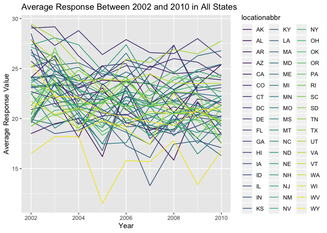
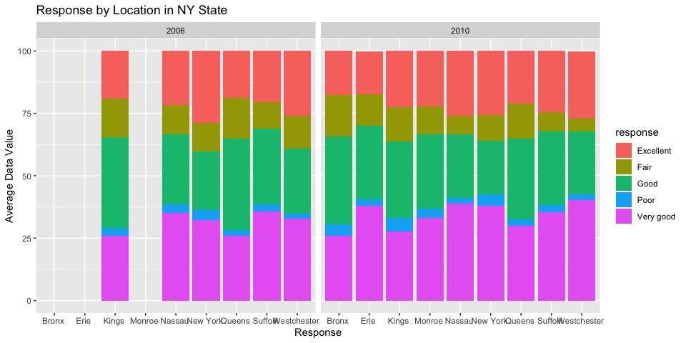
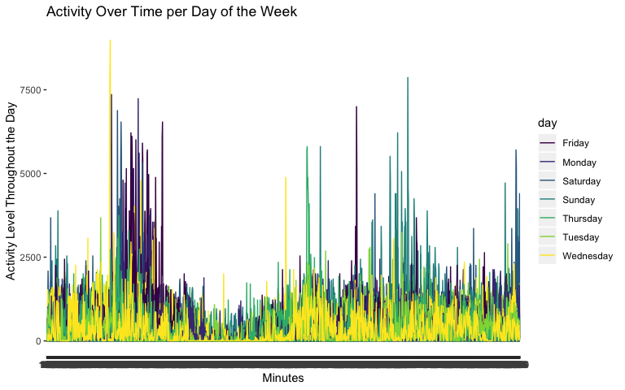

HW3
================

\#Load Libraries and Set-Up

\#Problem 1

``` r
#Load data from p8105 git repository

library(p8105.datasets)
data("instacart")

##Exploratory analysis to look at generally what products, aisles, and how many of each product are ordered
instacart_df =
  select(instacart, product_name, department, add_to_cart_order, reordered) %>%
  mutate(number_order = add_to_cart_order + reordered) %>%
  arrange(department) %>%
  select(-add_to_cart_order, -reordered)

instacart_df
```

    ## # A tibble: 1,384,617 x 3
    ##    product_name                 department number_order
    ##    <chr>                        <chr>             <int>
    ##  1 Chardonnay Wine              alcohol               4
    ##  2 Sauvignon Blanc              alcohol               2
    ##  3 India Pale Ale               alcohol               6
    ##  4 Lucky 13 Ale                 alcohol               1
    ##  5 Triple Distilled Vodka       alcohol               2
    ##  6 American Concord Grape       alcohol               9
    ##  7 Vodka                        alcohol               2
    ##  8 Pinot Noir                   alcohol               8
    ##  9 Chardonnay Sonoma Coast 2008 alcohol               9
    ## 10 Chianti Classico             alcohol              10
    ## # … with 1,384,607 more rows

\#\#Aisles Questions

``` r
#Create a variable that shows the aisles only (smaller dataset)
aisles_df = 
  select(instacart, aisle_id, aisle, product_name, add_to_cart_order, reordered)

#Finding the number of distinct aisles 
nrow(distinct(aisles_df, aisle_id))
```

    ## [1] 134

``` r
#Finding the aisles where the most items are ordered from by grouping them and summarizing number of observations within the aisles column and arranging them in descending order
number_item_df = 
  group_by(aisles_df, aisle) %>%
  summarize(n = n()) %>%
  arrange(desc(n)) %>%
  mutate(number_item = (n)) %>%
  select(-n)

number_item_df
```

    ## # A tibble: 134 x 2
    ##    aisle                         number_item
    ##    <chr>                               <int>
    ##  1 fresh vegetables                   150609
    ##  2 fresh fruits                       150473
    ##  3 packaged vegetables fruits          78493
    ##  4 yogurt                              55240
    ##  5 packaged cheese                     41699
    ##  6 water seltzer sparkling water       36617
    ##  7 milk                                32644
    ##  8 chips pretzels                      31269
    ##  9 soy lactosefree                     26240
    ## 10 bread                               23635
    ## # … with 124 more rows

There are 134 aisles in the dataset with fresh vegetables, fresh fruits,
and packaged vegetables fruits aisles containing the most items ordered.
The average number of items ordered across all of the aisles is
1.033296310^{4}. The median number of items ordered across all of the
aisles is 4723.

\#\#Number of items ordered in each
aisle

``` r
#Grouped by aisle and summarized by number of observations and then filtered by n > 10000 and renamed the column
ordered_items = 
  group_by(aisles_df, aisle) %>%
  summarize(n = n()) %>%
  arrange(desc(n)) %>%
  filter(n > 10000) %>%
  mutate(number_item = (n)) %>%
  select(-n)

ordered_items
```

    ## # A tibble: 39 x 2
    ##    aisle                         number_item
    ##    <chr>                               <int>
    ##  1 fresh vegetables                   150609
    ##  2 fresh fruits                       150473
    ##  3 packaged vegetables fruits          78493
    ##  4 yogurt                              55240
    ##  5 packaged cheese                     41699
    ##  6 water seltzer sparkling water       36617
    ##  7 milk                                32644
    ##  8 chips pretzels                      31269
    ##  9 soy lactosefree                     26240
    ## 10 bread                               23635
    ## # … with 29 more rows

## Ggplot of aisles with more than 10,000 items

``` r
#Created a ggplot of the items that were ordered more than 10,000 timesm the products are in alphabetical order
ggplot(ordered_items, aes(x = number_item, y = aisle, color = aisle)) +
         geom_point() +
  labs(
    title = "Number of Items Ordered per Aisle",
    x = "Number of Items Ordered",
    y = "Aisle Name"
  )
```

<!-- -->

## Table of top three items in Baking Ingredients, Dog Food Care, and Packaged Vegetables Fruits

``` r
#Filtering the instacart data by baking ingredients, dog food care, and packaged vegetables fruits and pivoting each of them wider, finding the number of times they were ordered, arranging them in descending order, and seeing the top three observations
top_baking_ing = 
  filter(instacart, 
         aisle == "baking ingredients") %>%
  pivot_wider(
         names_from = "aisle",
         values_from = "product_name") %>%
  mutate(number_ordered = 
         add_to_cart_order + reordered) %>%
  arrange(desc(number_ordered)) %>%
  head(3)
  
top_baking_ing
```

    ## # A tibble: 3 x 15
    ##   order_id product_id add_to_cart_ord… reordered user_id eval_set
    ##      <int>      <int>            <int>     <int>   <int> <chr>   
    ## 1  1482636      30751               68         0  111302 train   
    ## 2  1747908      26767               56         0  145432 train   
    ## 3  2190647      23537               56         0   59753 train   
    ## # … with 9 more variables: order_number <int>, order_dow <int>,
    ## #   order_hour_of_day <int>, days_since_prior_order <int>, aisle_id <int>,
    ## #   department_id <int>, department <chr>, `baking ingredients` <chr>,
    ## #   number_ordered <int>

``` r
top_dog_food = 
  filter(instacart, 
         aisle == "dog food care") %>%
  pivot_wider(
         names_from = "aisle",
         values_from = "product_name") %>%
  mutate(number_ordered = 
        add_to_cart_order + reordered) %>%
  arrange(desc(number_ordered)) %>%
  head(3)

top_dog_food
```

    ## # A tibble: 3 x 15
    ##   order_id product_id add_to_cart_ord… reordered user_id eval_set
    ##      <int>      <int>            <int>     <int>   <int> <chr>   
    ## 1    45138      26512               66         0   82931 train   
    ## 2  2893277      32168               54         0  148012 train   
    ## 3  2706631      42355               47         0   24909 train   
    ## # … with 9 more variables: order_number <int>, order_dow <int>,
    ## #   order_hour_of_day <int>, days_since_prior_order <int>, aisle_id <int>,
    ## #   department_id <int>, department <chr>, `dog food care` <chr>,
    ## #   number_ordered <int>

``` r
top_packaged = 
  filter(instacart, aisle == "packaged vegetables fruits") %>%
    pivot_wider(
      names_from = "aisle",
      values_from = "product_name"
    ) %>%
  mutate(number_ordered = add_to_cart_order + reordered) %>%
  arrange(desc(number_ordered)) %>%
  head(3)
  
top_packaged
```

    ## # A tibble: 3 x 15
    ##   order_id product_id add_to_cart_ord… reordered user_id eval_set
    ##      <int>      <int>            <int>     <int>   <int> <chr>   
    ## 1  2813632      41771               80         1  149753 train   
    ## 2  1395075      45063               78         1  197541 train   
    ## 3  2869702       4920               74         1   83993 train   
    ## # … with 9 more variables: order_number <int>, order_dow <int>,
    ## #   order_hour_of_day <int>, days_since_prior_order <int>, aisle_id <int>,
    ## #   department_id <int>, department <chr>, `packaged vegetables
    ## #   fruits` <chr>, number_ordered <int>

\#\#Binding the three
datasets

``` r
#Now that I have each of the top three items from the three aisles, I bind the rows together and arrange them in descending order of ordered number

top_three = 
  bind_rows(top_baking_ing, top_dog_food, top_packaged) %>%
  janitor::clean_names() %>%
  select(-everything(), number_ordered, baking_ingredients, dog_food_care, packaged_vegetables_fruits) %>%
  arrange(desc(number_ordered))

top_three
```

    ## # A tibble: 9 x 4
    ##   number_ordered baking_ingredients  dog_food_care      packaged_vegetable…
    ##            <int> <chr>               <chr>              <chr>              
    ## 1             81 <NA>                <NA>               Fresh European Sty…
    ## 2             79 <NA>                <NA>               Organic Baby Bella…
    ## 3             75 <NA>                <NA>               Seedless Red Grapes
    ## 4             68 All-Purpose Flour   <NA>               <NA>               
    ## 5             66 <NA>                Sausage Cuts Real… <NA>               
    ## 6             56 No Calorie Sweeten… <NA>               <NA>               
    ## 7             56 Light Brown Sugar   <NA>               <NA>               
    ## 8             54 <NA>                Dentastix Small/M… <NA>               
    ## 9             47 <NA>                ProActive Health … <NA>

The top three items in the baking ingredients aisle are all-purpose
flour, no calorie sweetner packets, and light brown sugar. In dog food
care it’s sausage cuts real beef treats, dentastix small/ medium dog
care & treats, and proactive health minichunks adult dog food. In
packaged vegetables fruits it’s fresh european style baby spinach,
organic baby bella mushrooms, and seedless red
grapes.

## Mean hour of the day Pink Lady Apples and Coffee Ice Cream

``` r
## To find the mean hour of the day that pink lady apples and coffee ice cream were ordered I created a new dataframe and filtered by the product name, grouped by product id, recoded week day to be the day of the week, grouped again by product name and week day, mutated to get the mean order hour of teh day, and arranged by day of the week. I used distinct to get only one value for each day of the week.
mean_hour = 
  select(instacart, product_id, product_name, order_hour_of_day, order_dow) %>%
  filter(product_name == "Pink Lady Apples" | product_name == "Coffee Ice Cream") %>%
  group_by(product_id) %>%
  mutate(week_day = recode(order_dow, 
       "0" = "Sunday",
       "1" = "Monday",
       "2" = "Tuesday",
       "3" = "Wednesday",
       "4" = "Thursday",
       "5" = "Friday",
       "6" = "Saturday")) %>%
  group_by(product_name, week_day) %>%
  mutate(mean_hour = mean(order_hour_of_day)) %>%
  select(-order_hour_of_day, -order_dow, -product_id) %>% 
  arrange(week_day) %>%
  distinct() %>%
  knitr::kable()

mean_hour
```

| product\_name    | week\_day | mean\_hour |
| :--------------- | :-------- | ---------: |
| Pink Lady Apples | Friday    |   12.78431 |
| Coffee Ice Cream | Friday    |   12.26316 |
| Pink Lady Apples | Monday    |   11.36000 |
| Coffee Ice Cream | Monday    |   14.31579 |
| Coffee Ice Cream | Saturday  |   13.83333 |
| Pink Lady Apples | Saturday  |   11.93750 |
| Pink Lady Apples | Sunday    |   13.44118 |
| Coffee Ice Cream | Sunday    |   13.77419 |
| Pink Lady Apples | Thursday  |   11.55172 |
| Coffee Ice Cream | Thursday  |   15.21739 |
| Coffee Ice Cream | Tuesday   |   15.38095 |
| Pink Lady Apples | Tuesday   |   11.70213 |
| Pink Lady Apples | Wednesday |   14.25000 |
| Coffee Ice Cream | Wednesday |   15.31818 |

\#Problem 2

## Cleaning BRFSS data

``` r
library(p8105.datasets)
data("brfss_smart2010")

#I downloaded the BRFSS data set, cleaned the names, filtered for the responses I wanted, and arranged the responses from poor to excellent
brfss_data = 
  select(brfss_smart2010, everything()) %>%
  janitor::clean_names() %>%
  filter(topic == "Overall Health" | 
           response == "Excellent" | 
           response == "Very good" | 
           response == "Good" |
           response == "Fair" |
           response == "Poor") %>%
  arrange(response == "Excellent", response == "Very good", response == "Good", response == "Fair", response == "Poor")

brfss_data
```

    ## # A tibble: 10,625 x 23
    ##     year locationabbr locationdesc class topic question response
    ##    <int> <chr>        <chr>        <chr> <chr> <chr>    <chr>   
    ##  1  2010 AL           AL - Jeffer… Heal… Over… How is … Poor    
    ##  2  2010 AL           AL - Mobile… Heal… Over… How is … Poor    
    ##  3  2010 AL           AL - Tuscal… Heal… Over… How is … Poor    
    ##  4  2010 AZ           AZ - Marico… Heal… Over… How is … Poor    
    ##  5  2010 AZ           AZ - Pima C… Heal… Over… How is … Poor    
    ##  6  2010 AZ           AZ - Pinal … Heal… Over… How is … Poor    
    ##  7  2010 AR           AR - Benton… Heal… Over… How is … Poor    
    ##  8  2010 AR           AR - Pulask… Heal… Over… How is … Poor    
    ##  9  2010 AR           AR - Washin… Heal… Over… How is … Poor    
    ## 10  2010 CA           CA - Alamed… Heal… Over… How is … Poor    
    ## # … with 10,615 more rows, and 16 more variables: sample_size <int>,
    ## #   data_value <dbl>, confidence_limit_low <dbl>,
    ## #   confidence_limit_high <dbl>, display_order <int>,
    ## #   data_value_unit <chr>, data_value_type <chr>,
    ## #   data_value_footnote_symbol <chr>, data_value_footnote <chr>,
    ## #   data_source <chr>, class_id <chr>, topic_id <chr>, location_id <chr>,
    ## #   question_id <chr>, respid <chr>, geo_location <chr>

``` r
#How many rows are in the dataset
nrow(brfss_data)
```

    ## [1] 10625

  - BRFSS data shows the health status of different locations across
    states in the US. The responses are recorded as excellent, very
    good, good, fair, or poor. There are 10,625 rows in this
dataset.

## 2002:states with 7 or more locations

``` r
## Created a new dataframe grouped by year and filtered for 2002, grouped by state abbreviation and counted the number of state abbreviations in the dataset, filtered for when the state had more than 7 locations
first_year_data = 
  group_by(brfss_data, year) %>%
  filter(year == 2002) %>%
  group_by(locationabbr) %>%
  count(locationabbr) %>%
  filter(n > 7) %>%
  mutate(number_locations = n) %>%
  select(-n)

first_year_data
```

    ## # A tibble: 36 x 2
    ## # Groups:   locationabbr [36]
    ##    locationabbr number_locations
    ##    <chr>                   <int>
    ##  1 AZ                         10
    ##  2 CO                         20
    ##  3 CT                         35
    ##  4 DE                         15
    ##  5 FL                         35
    ##  6 GA                         15
    ##  7 HI                         20
    ##  8 ID                         10
    ##  9 IL                         15
    ## 10 IN                         10
    ## # … with 26 more rows

  - The average number of locations a state had in 2002 was 20. \#\#
    2010: states with 7 or more
locations

<!-- end list -->

``` r
# Created a new dataframe grouped by year and filtered for 2010, grouped by state abbreviation and counted the number of state abbreviations in the dataset, filtered for when the state had more than 7 locations
second_year_data = 
  group_by(brfss_data, year) %>%
  filter(year == 2010) %>%
  group_by(locationabbr) %>%
  count(locationabbr) %>%
  filter(n > 7) %>%
  mutate(number_locations = n) %>%
  select(-n)

second_year_data
```

    ## # A tibble: 45 x 2
    ## # Groups:   locationabbr [45]
    ##    locationabbr number_locations
    ##    <chr>                   <int>
    ##  1 AL                         15
    ##  2 AR                         15
    ##  3 AZ                         15
    ##  4 CA                         60
    ##  5 CO                         35
    ##  6 CT                         25
    ##  7 DE                         15
    ##  8 FL                        205
    ##  9 GA                         20
    ## 10 HI                         20
    ## # … with 35 more rows

  - The average number of locations a state had in 2010 was 33.1111111.

\#\#Excellent responses across
statements

``` r
##Filtered the BRFSS data for excellent responses, grouped by state abbreviation adn year, mutated to find the mean value per location, and grouped by state abbreviation again
excellent_response = 
  select(brfss_data, response, year, locationabbr, data_value) %>%
  filter(response == "Excellent") %>%
  group_by(locationabbr, year) %>%
  mutate(data_location = mean(data_value)) %>%
  select(-data_value) %>%
  group_by(locationabbr) %>%
  distinct()

excellent_response
```

    ## # A tibble: 443 x 4
    ## # Groups:   locationabbr [51]
    ##    response   year locationabbr data_location
    ##    <chr>     <int> <chr>                <dbl>
    ##  1 Excellent  2010 AL                    18.4
    ##  2 Excellent  2010 AZ                    21.6
    ##  3 Excellent  2010 AR                    25.4
    ##  4 Excellent  2010 CA                    23.9
    ##  5 Excellent  2010 CO                    25.4
    ##  6 Excellent  2010 CT                    24.2
    ##  7 Excellent  2010 DE                    20.3
    ##  8 Excellent  2010 DC                    26.1
    ##  9 Excellent  2010 FL                    NA  
    ## 10 Excellent  2010 GA                    23.1
    ## # … with 433 more rows

## Spaghetti plot of above dataset

``` r
# Created a ggplot of the excellent responses across the years by state abbreviations
ggplot(excellent_response, aes(x = year, y = data_location)) + 
  geom_line(aes(
    group = locationabbr, 
    color = locationabbr)) + 
  labs(
    title = 
        "Average Response Between 2002 and 2010 in All States",
    x = "Year",
    y = "Average Response Value") +
  scale_color_viridis(
    name = "locationabbr",
    discrete = TRUE
  ) 
```

    ## Warning: Removed 3 rows containing missing values (geom_path).

<!-- -->

\#\#Two panel plot showing the states in 2006 and
2010

``` r
## Filtered the BRFSS data for the state of NY, grouped by locations and response by year. Created a mean of data value by location and filtered for either 2006 or 2010
ny_state = 
  select(brfss_data, response, year, locationabbr, locationdesc, data_value) %>%
  filter(locationabbr == "NY") %>%
  group_by(locationdesc, response, year) %>%
  mutate(data_location = mean(data_value)) %>%
  select(-data_value) %>%
  group_by(locationabbr) %>%
  filter(xor(year == "2006", 
             year == "2010")) %>%
  distinct()

ny_state
```

    ## # A tibble: 75 x 5
    ## # Groups:   locationabbr [1]
    ##    response  year locationabbr locationdesc            data_location
    ##    <chr>    <int> <chr>        <chr>                           <dbl>
    ##  1 Poor      2010 NY           NY - Bronx County                 4.7
    ##  2 Poor      2010 NY           NY - Erie County                  2.5
    ##  3 Poor      2010 NY           NY - Kings County                 5.5
    ##  4 Poor      2010 NY           NY - Monroe County                3.5
    ##  5 Poor      2010 NY           NY - Nassau County                2.3
    ##  6 Poor      2010 NY           NY - New York County              4.5
    ##  7 Poor      2010 NY           NY - Queens County                2.7
    ##  8 Poor      2010 NY           NY - Suffolk County               2.6
    ##  9 Poor      2010 NY           NY - Westchester County           2.2
    ## 10 Poor      2006 NY           NY - Kings County                 3.3
    ## # … with 65 more rows

## Plot of NY in 2006 and 2010

``` r
#Created a ggplot of NY responses by location between 2006 and 2010. The colors in the bars represent the different locations and the bars themselves are the responses.
ggplot(ny_state, aes(x = response, y = data_location, fill = locationdesc)) +
  geom_col() + 
  labs(
    title = "Response by Location in NY State",
    x = "Response",
    y = "Average Data Value"
  ) + 
  scale_color_viridis(
    name = "locationdesc",
    discrete = TRUE
  ) +
  facet_grid(~year)
```

<!-- -->

\#Problem
3

``` r
# Read in the accel data, cleaned names, pivoted longer, and grouped by day. Created a new variable for weekend vs weekday and pulled the prefix "activity_" out of the minute variable.
accel_data = 
  read_csv(file = "/Users/hannahbowlin/Documents/Biostats Sem 1/Data Science 1/Data Science/Data Science 1 part a/Visualization and EDA/p8105_hw3_hmb2161/accel_data.csv") %>%
  janitor::clean_names() %>%
  pivot_longer(activity_1:activity_1440,
    names_to = "minute",
    values_to = "activity_amount"
  ) %>%
  group_by(day) %>%
  mutate(type = if_else(day == c("Sat", "Sun"), "weekend", "weekday")) %>%
  mutate(minute = str_replace(minute, "activity_", " "))
```

    ## Parsed with column specification:
    ## cols(
    ##   .default = col_double(),
    ##   day = col_character()
    ## )

    ## See spec(...) for full column specifications.

``` r
accel_data
```

    ## # A tibble: 50,400 x 6
    ## # Groups:   day [7]
    ##     week day_id day    minute activity_amount type   
    ##    <dbl>  <dbl> <chr>  <chr>            <dbl> <chr>  
    ##  1     1      1 Friday " 1"              88.4 weekday
    ##  2     1      1 Friday " 2"              82.2 weekday
    ##  3     1      1 Friday " 3"              64.4 weekday
    ##  4     1      1 Friday " 4"              70.0 weekday
    ##  5     1      1 Friday " 5"              75.0 weekday
    ##  6     1      1 Friday " 6"              66.3 weekday
    ##  7     1      1 Friday " 7"              53.8 weekday
    ##  8     1      1 Friday " 8"              47.8 weekday
    ##  9     1      1 Friday " 9"              55.5 weekday
    ## 10     1      1 Friday " 10"             43.0 weekday
    ## # … with 50,390 more rows

  - In this new dataset there are 5 columns instead of over a 1400.
    There are now rows and columns. The variables are week, day\_id,
    day, minute of the day, and amount of activity in that minute.

\#\#Total activity per
day

``` r
## I grouped by week and day and then mutated activity amount to be the mean of each day within each week. I then divided mean activity by 60 to give the mean activity in hours. I deselected columns that don't matter and arranged by day of teh week. 
accel_day_data =
  group_by(accel_data, week, day) %>%
  mutate(mean_activity = mean(activity_amount)) %>%
  select(-type) %>%
  group_by(day) %>%
  arrange(day) %>%
  distinct()

accel_day_data
```

    ## # A tibble: 50,400 x 6
    ## # Groups:   day [7]
    ##     week day_id day    minute activity_amount mean_activity
    ##    <dbl>  <dbl> <chr>  <chr>            <dbl>         <dbl>
    ##  1     1      1 Friday " 1"              88.4          334.
    ##  2     1      1 Friday " 2"              82.2          334.
    ##  3     1      1 Friday " 3"              64.4          334.
    ##  4     1      1 Friday " 4"              70.0          334.
    ##  5     1      1 Friday " 5"              75.0          334.
    ##  6     1      1 Friday " 6"              66.3          334.
    ##  7     1      1 Friday " 7"              53.8          334.
    ##  8     1      1 Friday " 8"              47.8          334.
    ##  9     1      1 Friday " 9"              55.5          334.
    ## 10     1      1 Friday " 10"             43.0          334.
    ## # … with 50,390 more rows

## The trends apparent in the above table are that week 4 seems to have less activity than other weeks. The first week has a lot of activity compared to other weeks. Tuesday’s activity is generally less than other days and Wednesday’s is more than other days. Tuesday and Wednesday are fairly consistent across weeks in their activity levels.

``` r
#Created a ggplot for accel day data where x is the minute and y is the activity throughout the day. Each line represents a day of the week and reflects how activity changes in one day. The colors represent the day of the week so you see the change over time for each day in different weeks.
ggplot(accel_day_data, aes(x = minute, y = activity_amount, color = day, group = day_id)) +
  geom_line(aes(color = day, group = day_id)) +
  labs(
    title = "Activity Over Time per Day of the Week",
        x = "Minutes",
        y = "Activity Throughout the Day (Minutes)"
  )
```

<!-- -->
